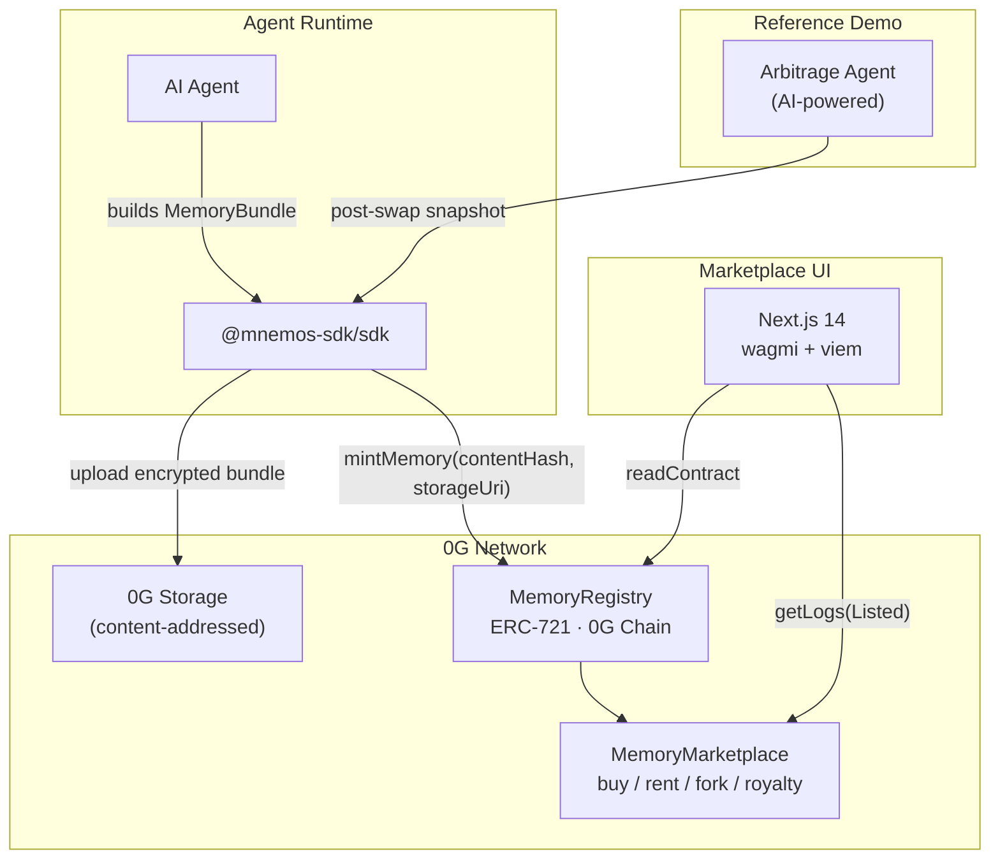

# Mnemos — On-Chain AI Agent Memory Protocol

> Built on 0G Network for the 0G APAC Hackathon

Mnemos turns an AI agent's operational memory into an ownable, transferable, and inheritable on-chain asset. Agents can snapshot their learned experience, mint it as an NFT on 0G Chain, and sell, rent, or fork it through a decentralized marketplace — all with royalty tracking for derivative agents.

| Repo | Purpose |
|---|---|
| [`menemos-ai/contract`](https://github.com/menemos-ai/contract) | Solidity contracts deployed on 0G Chain |
| [`menemos-ai/backend`](https://github.com/menemos-ai/backend) | TypeScript SDK (`@mnemos-sdk/sdk`) + NestJS API + reference agent |
| [`menemos-ai/frontend`](https://github.com/menemos-ai/frontend) | Next.js 14 marketplace UI |
| [`menemos-ai/arbitrage-agent`](https://github.com/menemos-ai/arbitrage-agent) | Autonomous AI arbitrage agent with Mnemos integration |

---

## What is Mnemos?

Every time an AI agent is redeployed, it loses everything it learned. Accumulated trading intuitions, refined reasoning patterns, domain-specific knowledge — gone. Developers have no way to preserve, transfer, or build on a previous agent's experience.

Mnemos solves this by making agent memory a first-class on-chain asset. An agent snapshots its current memory state, uploads it to 0G Storage, and mints a provenance NFT on 0G Chain. That memory token can be sold, rented by other agents, or forked to create a child agent that inherits the parent's knowledge — with a royalty flowing back to the original creator whenever a child agent earns.

---

## 0G Technical Integration

Mnemos integrates two 0G Network modules:

### 0G Chain (EVM-compatible · chain ID 16661)

All protocol logic lives on 0G Chain as two Solidity contracts:

- **MemoryRegistry** (`ERC-721`) — each minted token is an immutable memory snapshot with a content hash, a pointer to 0G Storage, a parent reference for fork lineage, creator address, and timestamp. The registry is the on-chain source of truth for provenance and lineage.
- **MemoryMarketplace** — handles all three monetization paths: `buy` (full ownership transfer), `rent` (time-bounded access with expiry tracking), and `fork` (mints a child token with royalty obligation). All payments settle in A0GI (native 0G token). Every state change emits an on-chain event (`Listed`, `Bought`, `Rented`, `Forked`, `RoyaltyPaid`) that the marketplace UI indexes directly.

### 0G Storage

Actual memory bundles — structured JSON that can be megabytes of agent state — are uploaded to 0G Storage via `@0gfoundation/0g-ts-sdk` (`Indexer.upload` + `MemData`). The SDK derives the encryption key from `keccak256(plaintext JSON)`, which also serves as the on-chain `contentHash`. Storage URIs are prefixed `v2:` for forward-compatible versioning. Downloads use `Indexer.download` with the same content-addressed URI.

This design means the on-chain record is compact (hash + URI + metadata) while the full memory content lives in decentralized storage — neither party needs to trust the other's infrastructure.

---

## System Architecture



The SDK (`@mnemos-sdk/sdk`) is the integration surface for agent developers. It handles encryption, 0G Storage upload, and on-chain minting in a single `snapshot()` call. The `autoSnapshot()` helper runs this on a configurable interval so agents never need to think about persistence. The Next.js frontend reads directly from 0G Chain via wagmi + viem — no backend database, no intermediary.

---

## Demo

> **Demo Video:** [https://youtu.be/m0DG4nA9Tvo](https://youtu.be/m0DG4nA9Tvo)
> **Pitching Video:** [https://youtu.be/qbAJWKf3-oo](https://youtu.be/qbAJWKf3-oo)

Judges can browse listed memory snapshots, inspect on-chain provenance (content hash, storage URI, lineage ancestors, creator, timestamp), and view the buy / rent / fork pricing — all without a wallet. The marketplace reads directly from 0G Chain.

To see live memory minting in action, search the MemoryMarketplace contract address on the 0G Chain explorer:
[`0xFeb5Ac77Cd7746e2b35825dA800458D660D10209` on chainscan.0g.ai](https://chainscan.0g.ai/address/0xFeb5Ac77Cd7746e2b35825dA800458D660D10209)

---

## Product Value

- **The problem:** AI agents are stateless by default. Every redeploy starts from zero — no institutional memory, no learned experience, no accumulated edge.
- **The solution:** Mnemos makes agent memory ownable. Snapshot it, mint it, sell it — or inherit it by forking a successful agent and paying a royalty to its creator.
- **Use cases:** A trading agent that learned profitable patterns sells its memory to other traders. A research agent rents access to a curated knowledge base. A support agent forks a top-performing agent and pays a royalty from its earnings.
- **Market framing:** Mnemos is the missing infrastructure layer for the agent economy — a decentralized marketplace where learned agent intelligence becomes a tradable asset, with provenance and royalties enforced on-chain.

---

## Technical Completeness

| Component | Status |
|---|---|
| `MemoryRegistry.sol` — ERC-721 with lineage tracking | Deployed on 0G Mainnet |
| `MemoryMarketplace.sol` — buy / rent / fork / royalty | Deployed on 0G Mainnet |
| [`@mnemos-sdk/sdk`](https://www.npmjs.com/package/@mnemos-sdk/sdk) — TypeScript SDK for agent developers | Published on npm |
| NestJS REST API — server-side SDK wrapper ([API docs](https://mnemos-api.up.railway.app/docs)) | Running |
| Next.js 14 marketplace UI — wagmi + viem | Deployed |
| Arbitrage agent demo — autonomous AI with Mnemos integration | Runnable |
| Foundry test suite — buy / rent / fork / royalty coverage | Passing |
| `WalletAuthGuard` — signature + timestamp verification for memory access | Implemented |

---

## Deployed Contracts

| Contract | Address | Network |
|---|---|---|
| MemoryRegistry (ERC-721) | [`0x848F7000223dd2eBa5ac30b37d52EdA8D058E72E`](https://chainscan.0g.ai/address/0x848F7000223dd2eBa5ac30b37d52EdA8D058E72E) | 0G Mainnet · chain ID 16661 |
| MemoryMarketplace | [`0xFeb5Ac77Cd7746e2b35825dA800458D660D10209`](https://chainscan.0g.ai/address/0xFeb5Ac77Cd7746e2b35825dA800458D660D10209) | 0G Mainnet · chain ID 16661 |

---

## Quick Start for Judges

### Track 1 — No wallet needed

1. Open the [live marketplace](https://github.com/menemos-ai/frontend) to browse active memory listings.
2. Search either contract address on the [0G Chain explorer](https://chainscan.0g.ai) to see live minted tokens and transaction history.
3. Open a listing to inspect on-chain provenance: content hash, storage URI, lineage, creator, timestamp.

### Track 2 — Run the reference agent yourself

Requires a wallet funded with A0GI. Get testnet tokens from [faucet.0g.ai](https://faucet.0g.ai).

```bash
git clone https://github.com/menemos-ai/backend.git
cd backend
pnpm install
```

Create a `.env` file:

```env
AGENT_PRIVATE_KEY=0x<your-wallet-private-key>

OG_CHAIN_ID=16661
OG_RPC_URL=https://evmrpc.0g.ai
OG_STORAGE_NODE=https://indexer-storage-turbo.0g.ai

REGISTRY_ADDRESS=0x848F7000223dd2eBa5ac30b37d52EdA8D058E72E
MARKETPLACE_ADDRESS=0xFeb5Ac77Cd7746e2b35825dA800458D660D10209
```

```bash
pnpm sdk:build
pnpm agent:run
```

The reference agent generates a synthetic trade every 2 seconds and triggers an on-chain memory snapshot every 30 seconds. You will see token IDs logged to stdout as they mint. Search your wallet address on [chainscan.0g.ai](https://chainscan.0g.ai) to confirm transactions landing.

For the full step-by-step integration guide, see [`HOW_TO_RUN.md`](https://github.com/menemos-ai/backend/blob/main/HOW_TO_RUN.md).

---

## SDK Integration

Install:

```bash
npm install @mnemos-sdk/sdk @0gfoundation/0g-ts-sdk
```

Five-minute integration:

```typescript
import { MnemosClient } from '@mnemos-sdk/sdk';

const mnemos = new MnemosClient({
  privateKey: process.env.AGENT_PRIVATE_KEY as `0x${string}`,
  chainId: 16661,
  rpcUrl: process.env.OG_RPC_URL!,
  storageNodeUrl: process.env.OG_STORAGE_NODE!,
  registryAddress: process.env.REGISTRY_ADDRESS as `0x${string}`,
  marketplaceAddress: process.env.MARKETPLACE_ADDRESS as `0x${string}`,
});

// Snapshot agent memory every 30 seconds — auto-uploads to 0G Storage and mints on 0G Chain
mnemos.autoSnapshot({
  intervalMs: 30_000,
  buildBundle: () => ({
    data: agent.getState(),
    metadata: { category: 'trading', agentId: 'my-agent-v1', version: '1.0.0' },
  }),
  onSnapshot: (r) => console.log(`Memory minted — token ${r.tokenId}, tx ${r.txHash}`),
  onError: (err) => console.error(`Snapshot failed: ${err.message}`),
});
```

That's it. The agent's memory is now an on-chain asset that can be listed, sold, rented, or forked. For marketplace operations (list, buy, rent, fork, royalty), see [`HOW_TO_RUN.md`](https://github.com/menemos-ai/backend/blob/main/HOW_TO_RUN.md).

---

## Reviewer Notes

- **0G Chain explorer:** [chainscan.0g.ai](https://chainscan.0g.ai) — search either contract address to see live activity
- **Faucet:** [faucet.0g.ai](https://faucet.0g.ai) — fund a wallet with A0GI to run Track 2 or interact with the marketplace
- **API docs:** [mnemos-api.up.railway.app/docs](https://mnemos-api.up.railway.app/docs) — Swagger UI for the NestJS REST API
- **npm package:** [npmjs.com/package/@mnemos-sdk/sdk](https://www.npmjs.com/package/@mnemos-sdk/sdk)
- **No backend database** — all persistent state lives on 0G Chain (NFTs, listings, rentals, royalties) or in 0G Storage (encrypted memory bundles). The NestJS API is a stateless wrapper around the SDK.
- **Privacy posture:** the v2 key scheme makes memory bundles readable by anyone who holds the `contentHash` (which is public on-chain). This is intentional for the marketplace model — buyers can verify content before purchasing. TEE-based key release is the v2 roadmap item for confidential memory.
- **Contracts are not production-audited** — use at your own risk.

---

## Team

| Name | Role |
|---|---|
| Singgih | Fullstack Developer |

---

## License

MIT
