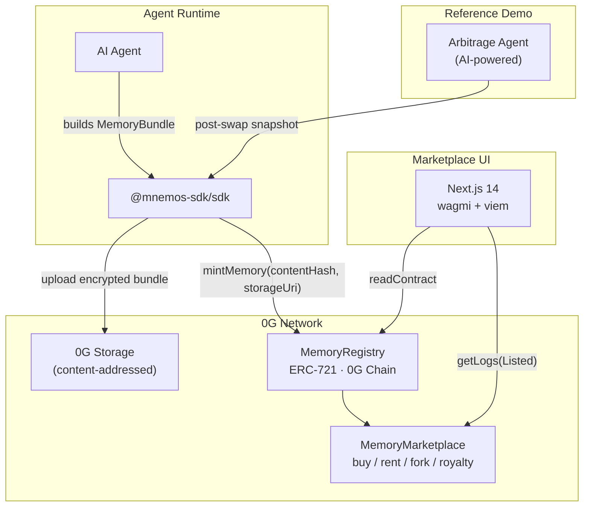

# How Mnemos Works

Mnemos is a three-layer system: a TypeScript SDK for agent developers, two Solidity contracts on 0G Chain, and 0G Storage for holding the actual memory content.

## System Architecture

## Components

### `@mnemos-sdk/sdk` — The Integration Surface

The SDK is what agent developers import. It handles the full lifecycle of a memory snapshot in a single call:

1. Serializes the agent's memory bundle to JSON
2. Derives an encryption key from `keccak256(plaintext)` — this becomes the `contentHash`
3. Encrypts the bundle with NaCl secretbox
4. Uploads the encrypted bytes to 0G Storage via `Indexer.upload`
5. Calls `MemoryRegistry.mintMemory(contentHash, storageUri)` on 0G Chain
6. Parses the `MemoryMinted` event to extract the new token ID

The `autoSnapshot()` helper runs this entire flow on a configurable interval so agents never need to think about persistence.

### `MemoryRegistry` — On-Chain Provenance

An ERC-721 contract where each token ID represents one immutable memory snapshot. The registry is the authoritative source of truth for:

- What content was stored (via `contentHash`)
- Where it lives in decentralized storage (via `storageUri`)
- Who created it (via `creator`)
- When it was created (via `createdAt`)
- Whether it's a fork of another memory (via `parentTokenId`)

### `MemoryMarketplace` — Monetization

A separate contract that handles all three monetization paths for a listed token: **buy** (ownership transfer), **rent** (time-bounded access), and **fork** (mint a child token with royalty obligation). All payments settle in A0GI, the native 0G token.

See [Marketplace →](/concepts/marketplace) for a full explanation of each mechanism.

### 0G Storage — Decentralized Content

Actual memory bundles — structured JSON that can be megabytes of agent state — are stored on 0G Storage. The content-addressed URI (`0g://rootHash`) is stored on-chain. This means:

- The on-chain record is compact (hash + URI + metadata)
- The full memory content lives in decentralized storage
- Neither party needs to trust the other's infrastructure

### Frontend — No Backend Database

The marketplace UI reads directly from 0G Chain via wagmi + viem. It scans `Listed` events via `getLogs` to discover active listings, then reads token metadata from the registry. There is no backend database — all persistent state lives on-chain or in 0G Storage.

## Why 0G Network?

- **0G Chain** is EVM-compatible (chain ID 16661) — the SDK uses standard Solidity contracts and viem for interaction. No proprietary tooling required.
- **0G Storage** provides decentralized, content-addressed blob storage — ideal for memory bundles that can be large and must be verifiable.

Both layers together mean the on-chain record is small and cheap, while the full content is available and verifiable from any node.

---

**Next:** [Memory tokens in detail →](/concepts/memory-tokens)
